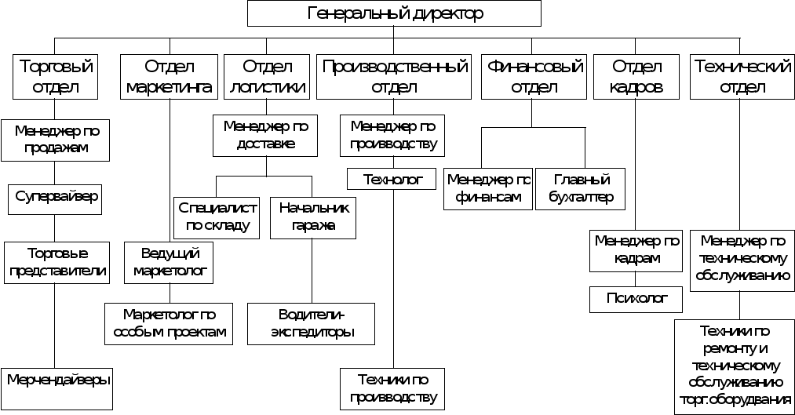

<h1>ТЕСТОВОЕ ЗАДАНИЕ на позицию 
Junior Python разработчик 
</h1>
 

# Создайте веб страницу, которая будет выводить иерархию сотрудников в древовидной форме.
● Информация о каждом сотруднике должна храниться в базе данных и
содержать следующие данные: ФИО; Должность; Дата приема на работу; Размер заработной платы; У каждого сотрудника есть 1 начальник;
● База данных должна содержать не менее 50 000 сотрудников и 5 уровней
иерархий.
● Создайте базу данных используя миграции Django / Flask.
● Используйте DB seeder для Django ORM / Flask-SQLAlchemy для заполнения
базы данных.
● Используйте Twitter Bootstrap для создания базовых стилей Вашей страницы.
● Создайте еще одну страницу и выведите на ней список сотрудников со всей
имеющейся о сотруднике информацией из базы данных и возможностью
сортировать по любому полю.
 

## 🛠️ В результате работы, на выходе получено:
- реализация с django, sqlite, bootstrap
- БД с моделями сотрудник, отдел, позиция
- в отделе реализована ииерархия с приктически неограниченными уровнями.

  
- реализована возможность перевода сотружников по отделам, а также назначать отделам начальников
- допустима смена подчинения у отделов
- реализовано заполнение базы рандомными данными
- имеется возможность поиска по по всем полям записей о сотрудниках:

 

